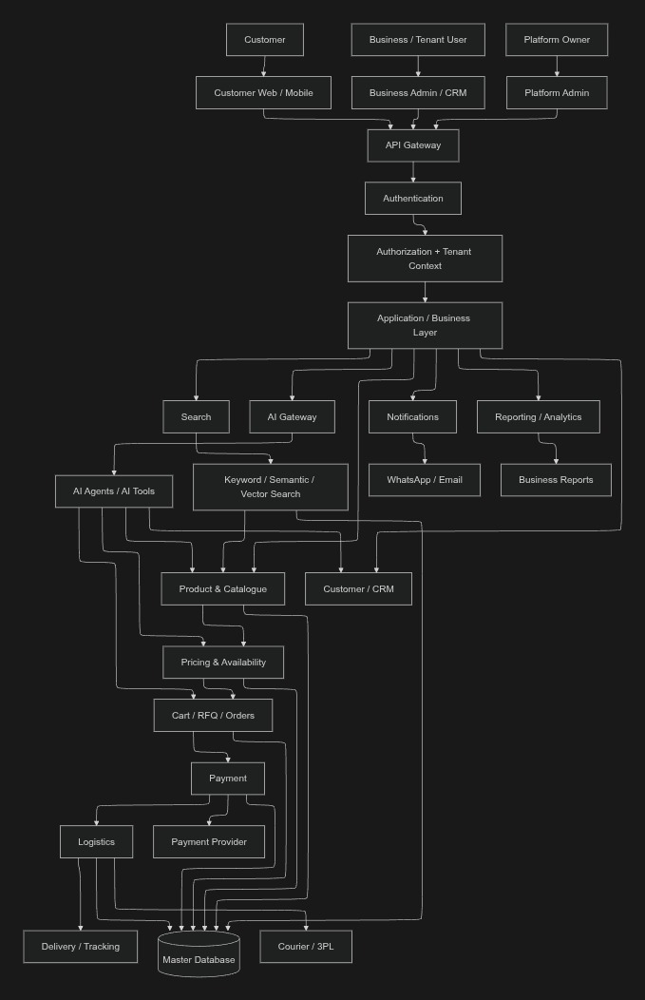
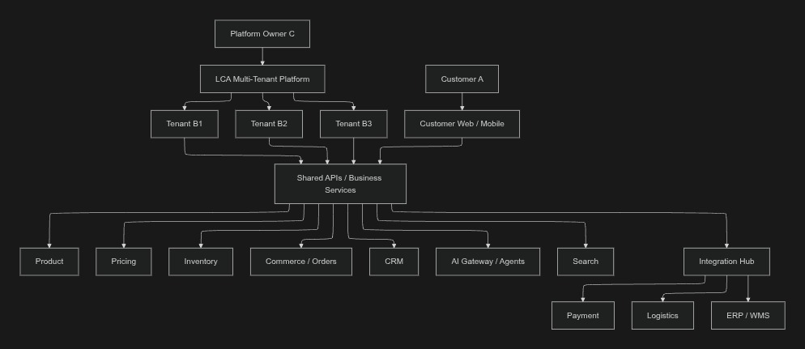
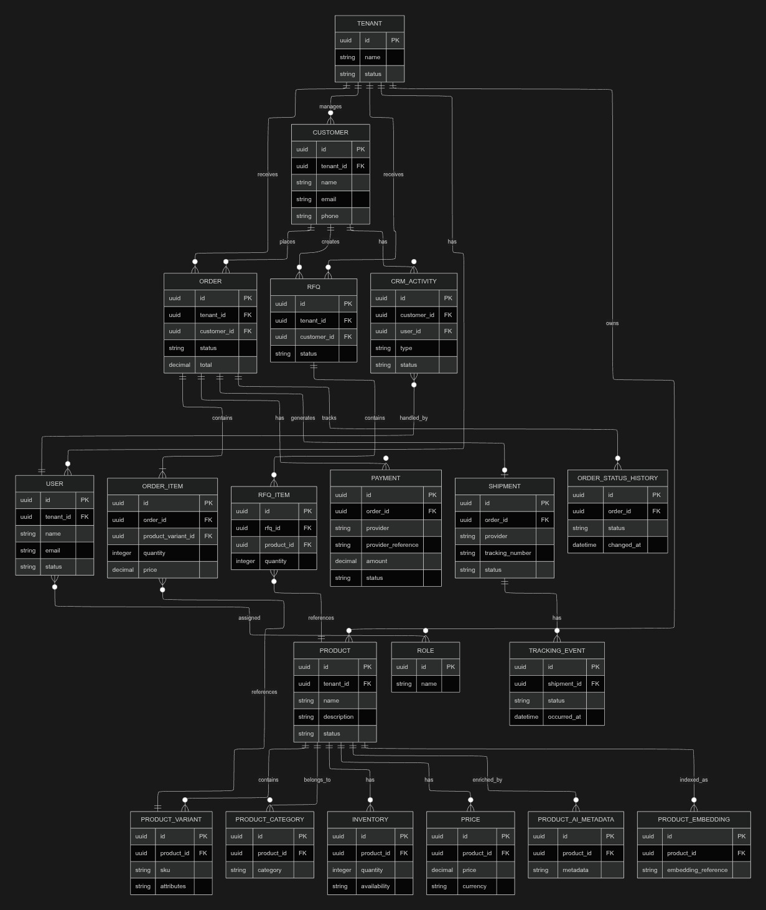

# Target Architecture

> **Scope note:** This document describes the complete-project target direction and identifies the current implementation boundary. The repository currently contains a .NET 10 modular monolith, one new shared-schema SQL Server database, ASP.NET Core Identity/JWT authentication, tenant-safe Catalog and Customer capabilities, a first Platform Owner administration slice, and a minimal Next.js administration UI. AI and Android elements shown in the conceptual visuals are not current implementation scope.

## Architectural style

The recommended initial style is a **modular platform / modular monolith**, not a fleet of microservices. The current backend is one ASP.NET Core server with three project boundaries: `Lca.Api` for HTTP/hosting composition, `Lca.Core` for the implemented LCA application and business behavior, and `Lca.Infrastructure` for technical implementations. The current implementation includes Identity and tenancy, Product/Category/Pricing/Inventory, Customer/contacts, Tenant 1-only migration boundaries, and the first Platform Owner administration slice. Further business modules are added only after their legacy behavior is characterized and accepted.

Logical module boundaries should be explicit from the start so that selected modules can later be extracted when justified.

## High-level topology

```text
                    Platform Owner C
                          |
                 Multi-Tenant Platform
                          |
          +---------------+---------------+
          |               |               |
       Tenant B1       Tenant B2       Tenant B3
          |               |               |
          +---------------+---------------+
                          |
                 Shared Secured APIs
                          |
       +------------------+------------------+
       |                  |                  |
 Customer Web/Mobile  Business Admin/CRM  Platform Admin
       |                  |                  |
       +------------------+------------------+
                          |
                  Business Platform
                          |
    Product | Pricing | Inventory | Commerce | CRM | RFQ
                          |
          AI | Search | Integrations | Reporting
```

## Backend request flow

```text
User
 -> Application
 -> API Gateway / API boundary
 -> Authentication
 -> Authorization + Tenant Context
 -> Application / Business Layer
 -> Domain capability
 -> Database / Cache / Search / Integration as appropriate
```

The term `API Gateway` in the diagrams describes the common secured entry boundary. The deployment may initially implement this inside the modular application rather than requiring a separate gateway product.

## Core architecture layers

### Interface/API boundary

Accepts customer, tenant-admin and platform-admin requests and exposes stable contracts.

### Authentication and authorization

Establishes identity, roles/policies and tenant context.

### Application/business layer

Coordinates use cases and calls domain capabilities. It must not bypass authorization or authoritative data ownership.

### Domain modules

Own business rules for Product, Pricing, Inventory, Commerce, CRM, RFQ, Payment, Logistics and other capabilities.

### Infrastructure/integration layer

Provides persistence and provider adapters without leaking provider-specific concerns into domain logic. Redis, dedicated Search, and event infrastructure remain deferred until an approved capability requires them.

## Possible scale evolution

These are future target proposals rather than PRD Sprint numbers. Only components required by an approved migration slice should be introduced.

### Current modular platform

- modular application
- one new shared-schema SQL Server database
- EF Core persistence with TenantId enforcement
- ASP.NET Core Identity and backend-issued JWTs
- explicit platform and tenant authorization boundaries

Redis, dedicated Search, and event infrastructure are future options, not current runtime dependencies.

### Phase 2

- background workers
- event bus
- independent Search/AI workers where useful

### Phase 3

Potentially extract high-load or independently operated modules such as:

- Search
- AI
- Notifications
- Marketing

### Phase 4

Potentially extract additional modules such as:

- Payment
- Logistics
- CRM

Extraction is conditional, not mandatory.

## Approved delivery dependency order

The modular boundaries are introduced incrementally in this order:

1. database access layer;
2. configuration foundation;
3. authentication, authorization, and trusted tenant context;
4. shared utilities required by an approved slice;
5. Product, Category, Pricing, and Inventory APIs (implemented current slice);
6. Customer and contact APIs (implemented current slice);
7. Platform Owner dashboard, Tenant lifecycle, Tenant-user provisioning, account recovery, and platform audit (implemented first platform slice);
8. Sales / Order APIs;
9. Quotation API;
10. Logistics API;
11. required Sales/report and CRM read endpoints.

This is a delivery priority, not permission to skip legacy characterization or cutover gates. Product, price, stock, and Customer facts are persisted in the new platform database for the implemented slices; the legacy database remains migration evidence/coexistence data and is not used as normal runtime persistence. Orders and later modules remain subject to their own characterization, migration, reconciliation, and cutover gates. External AI systems may consume approved APIs, but AI agents, orchestration, and AI-specific migration modules remain outside this repository's current implementation scope.

## Architecture diagrams

The following images describe the complete-project target concept. They do not establish the legacy schema, current deployment topology, or the status of an individual migrated slice. For current implementation status, use `.agents/codex/02-CURRENT-STATE.md`.

### Architecture principle



### Main business flow



### Conceptual target ER diagram



Legacy physical database facts must come from the [database documentation](database/README.md) and restored-database evidence.

## Related documents

- [Documentation guide and current Sprint 1 scope](buffer/README.md)
- [Migration strategy](buffer/MIGRATION_STRATEGY.md)
- [Complete-project PRD](LCA_2.5_Month_PRD.md)

The linked PRD is a historical draft/reference document. It is not authoritative for current database, AI, Android, or delivery scope; the accepted Codex decision and current-state documents take precedence.
