# Existing LCA Platform — System Inventory & Architecture Mapping

## Purpose

This document answers a practical question:

> What exists in the current LCA system, how do its major parts connect, where does the data live, and how does information move through the application?

It summarizes the completed Phase 1 discovery in a form suitable for both business and technical stakeholders. It is an architecture and dependency map, not a replacement specification and not a claim about infrastructure that could not be seen in the supplied source and database evidence.

## 1. Executive Summary

The existing LCA platform is a server-rendered ASP.NET Web Forms application running on the .NET Framework 4.8 generation of Microsoft technology. Users work through browser pages, while mobile or other clients may call page-based API endpoints and an older ASMX web service. **Verified**

The application is not divided into independent services. A page can display the user interface, validate input, execute business rules, read or write SQL Server, generate a file, and contact an external provider within the same request. Shared code exists under `App_Code`, but database and business behavior is also spread across page code, Web Forms markup, stored procedures, and database-side logic. **Verified**

Authentication creates a server-side ASP.NET session. That session holds the user name, administrative status, permission-like flags, and some workflow state. Navigation is shown or hidden from these values, but direct-page, Page WebMethod, ASMX, mobile, and API enforcement is inconsistent. Firm or business context is influenced by host names, firm records, configured database connections, user data, and sometimes caller input; the repository does not prove one secure tenant boundary. 

The principal database evidence is the restored SQL Server database named `elinver`. It contains 127 user tables and substantial stored logic. Only six foreign keys are declared, so many business connections are enforced by application queries or conventions rather than by SQL Server constraints. The application also depends on public or writable web folders for product images, imports, invitation images, delivery evidence, synchronization snapshots, and generated order, quotation, purchase, ledger, and invoice documents. 

External-service code exists for push notifications, SMS, email, maps/roads, a WhatsApp task OTP endpoint, remote product/content retrieval, an e-commerce database, and PDF conversion. Source evidence proves that code paths exist; it does not prove that every provider, account, endpoint, or caller remains active in production.

This inventory matters because replacing a page does not necessarily replace the whole capability. Other pages, APIs, procedures, files, integrations, and external clients may still depend on the same identifiers and behavior. Safe migration therefore requires moving complete business capabilities while preserving compatibility until the new path has been reconciled and accepted.

> **Key takeaway:** LCA is one interconnected operational platform. The database, session, files, and external side effects are part of the application—not separate implementation details that can be ignored during migration.

## 2. Current-System Architecture

### High-level architecture

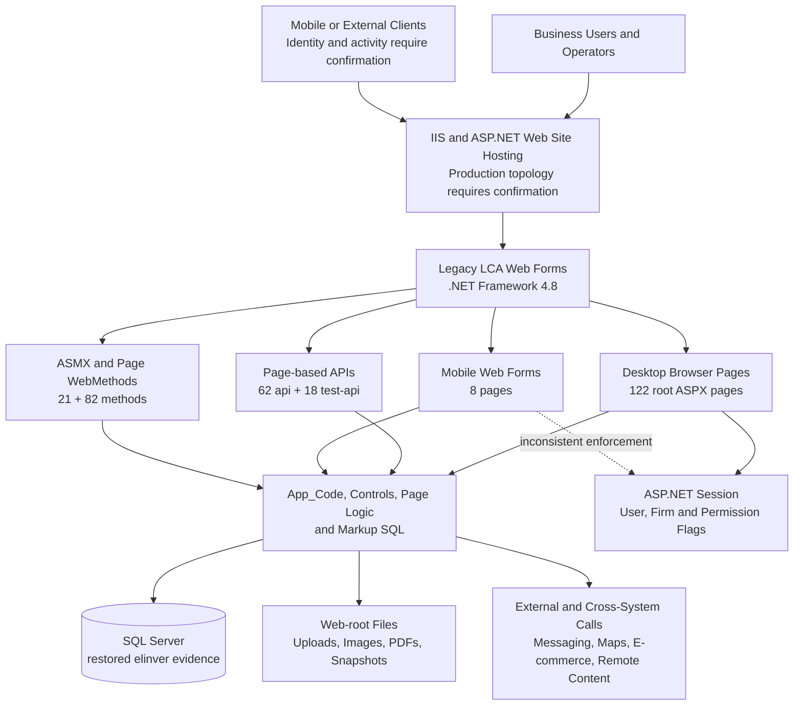

The browser-facing site, API-like endpoints, mobile pages, and services are different entry points into the same broad Web Forms application. They share SQL Server data, helper classes, and filesystem paths. Some requests also call messaging providers, mapping services, remote sites, or the e-commerce database.

The diagram deliberately does not name a production load balancer, reverse proxy, number of IIS servers, or network storage product. Those deployment details were not present in the repository and require production confirmation.

### Where behavior currently lives

| Location | Current responsibility | Evidence state |
| --- | --- | --- |
| ASPX markup and `SqlDataSource` controls | Page layout plus direct database reads and CRUD operations | **Verified** |
| ASPX code-behind | Validation, workflows, SQL, response formatting, file generation, and provider calls | **Verified** |
| `App_Code/db.cs` | Shared ADO.NET helpers and optional transaction support; not used universally | **Verified** |
| `App_Code/CommonFunction.cs` | Synchronization, email, SMS, push notification, dynamic-link, and other cross-cutting helpers | **Verified** |
| `App_Code/WebService.cs` | Shared ASMX selectors for customers, products, categories, and related data | **Verified** |
| SQL Server procedures/functions/trigger | Order, purchasing, import, print, history, splitting, and product-image synchronization behavior | **Verified** for restored `elinver` |
| Filesystem | Durable business documents, uploads, images, import snapshots, and synchronization exports | **Verified** |

## 3. Application Inventory

### Verified application surfaces

The inspected legacy snapshot contains **216 ASPX pages in total**, grouped below by application surface. The purpose of this summary is to show the architecture and capability shape rather than reproduce a file-by-file inventory.

| Surface | Verified size | What it means | Operational status |
| --- | ---: | --- | --- |
| Root desktop Web Forms | 122 ASPX pages with matching code-behind | Main administrative and operational UI, reports, print pages, and callable methods | **Verified** source; deployed usage requires confirmation |
| `api/` | 62 ASPX endpoints | Direct request handlers returning JSON, XML, text, images, PDFs, or other responses | **Verified** surface; consumers require confirmation |
| `test-api/` | 18 ASPX endpoints | Same-named subset of `api/`; 12 of 18 code-behind pairs differ | **Verified** difference; active status requires confirmation |
| `mobile/` | 8 ASPX pages | Separate compact Web Forms interface sharing legacy state | **Verified** surface; users and reachability require confirmation |
| `deepak/` | 6 ASPX pages | Partial alternate site with its own shell and mixed copied/divergent pages | **Verified** structure; purpose requires confirmation |
| ASMX URLs | 2 URLs sharing one service implementation | Older RPC/AJAX service surface | **Verified**; external callers require confirmation |
| Page WebMethods | 82 methods across 27 pages | AJAX-callable operations attached to page URLs | **Verified** |
| ASMX WebMethods | 21 methods | Shared service operations; three explicitly enable session | **Verified** |

### Functional grouping

These areas are evidence-backed groupings used to explain the legacy application. They are **Inferred** capability boundaries, not proof that the legacy code contains formal modules or separate services.

| Area / Module | Main responsibility | Representative UI / endpoint examples | Important data and dependencies | Status |
| --- | --- | --- | --- | --- |
| Identity, users, permissions, and firm context | Login, logout, user administration, menu visibility, firm and permission maintenance | `Login.aspx`, `LoginByInvitation.aspx`, `Logout.aspx`, `User.aspx`, `PageMapping.aspx`, `FirmDetail.aspx` | `Logintbl`, `Mobile_FirmDetail`, page/group/area/customer permission tables, ASP.NET Session | **Verified** grouping; permission precedence requires confirmation |
| Product, category, and catalogue | Product master, category/group/type/unit data, images, specifications, mapping, import, and catalogue output | `Product.aspx`, `ProductEdit.aspx`, `ProductEdit2.aspx`, `ProductGroup.aspx`, `Category.aspx` | `Mobile_ItemMaster`, lookup/specification tables, image folders, e-commerce database, import procedures | **Verified** grouping |
| Customers, contacts, and invitations | Customer records, contacts, assignments, invitations, contact review, history, and outstanding views | `MobileCustomer.aspx`, `MobileCustomerContact.aspx`, `CustomerInviteNew.aspx`, `UpdatedContact.aspx` | `Mobile_Customertbl`, fixed contact slots, normalized contact tables, permissions, SMS/FCM, invitation images | **Verified** grouping; canonical contact model requires confirmation |
| Sales orders and fulfillment | Order capture, item pricing, dispatch preparation, cartons, printing, bills, and order images | `NewOrderDetail.aspx`, `OrderDetail.aspx`, `OrderViaBarcode.aspx`, `Home.aspx`, output pages | Customer/product/order tables, procedures, trips, files, SMS/push | **Verified** grouping |
| Transportation and delivery | Carrier/trip allocation, quantities, delivery evidence, location, communications, and payment-related transport records | `Transportationhistory.aspx`, `transportation.aspx`, `TransportationPayment.aspx`, `api/GetImages.aspx` | Orders, `Triptbl`, transaction rows, carriers, maps, images, SMS/email/push | **Verified** grouping |
| Quotations / RFQ | Quote creation, editing, rejection, output, external synchronization, and conversion to sales orders | `Cotation.aspx`, `DeletedCotation.aspx`, `api/InsertQuatationData.aspx`, `api/CotationPDF.aspx` | Quotation/customer/product/pricing data, firm routing, e-commerce links, attachments, PDFs, notifications | **Verified** grouping; external consumers require confirmation |
| Suppliers and purchasing | Supplier master, purchase order creation, fulfillment, transport, print, and PDF output | `Supplier.aspx`, `PurchaseOrderDetails.aspx`, `PendingPurchaseOrder.aspx`, `api/InsertPurchaseJsonData.aspx` | Supplier/product/purchase tables and procedures, shared trip state, PDFs, email/SMS | **Verified** grouping |
| Reporting, ledger, and client views | Cross-module operational reports, customer history/outstanding, ledger, and generated output | `ReportCustomerWise.aspx`, `ReportItemWise.aspx`, `Ledger.aspx`, `LedgerPDF.aspx` | Customer, product, order, receipt, return, sales, and import snapshot data | **Verified** cross-cutting grouping |
| Content, catalogue output, and engagement | Blog, banner, catalogue PDF, reminders, invitations, marketing staging, and remote directory ingestion | `AddBlogDescription.aspx`, `UploadBanner.aspx`, `PDFCatalog.aspx`, `Calendar.aspx`, `WhatsappMarketing.aspx` | Product/customer/content rows, files, e-commerce data, remote services | **Verified** grouping; scheduler/sender ownership requires confirmation |
| Warehouse / Godown | Category-address hierarchy surfaced in navigation | `CategoryAddress.aspx` and alternate variant | Hierarchy data and users | **Inferred** boundary |

### Structural areas and what they mean

- **Root ASPX application:** the main desktop/admin application. Pages frequently combine presentation, business logic, data access, and output generation.
- **`api/`:** legacy HTTP endpoints implemented as ASPX pages rather than a centralized API framework. Their exact URL, request, response, and error behavior may be consumed externally.
- **`test-api/`:** alternate implementations with overlapping names but meaningful code differences. The name “test” is not evidence that they are unused.
- **`mobile/`:** a separate Web Forms user interface that shares business data with the desktop application. Its master page has no active authentication check.
- **`deepak/`:** a partial alternate application with its own navigation and a shared ASMX implementation. Its deployment status is unknown.
- **Shared controls and master pages:** two active-looking desktop shells implement different navigation and permission styles; controls compose the newer shell.
- **`App_Code`:** runtime-compiled shared database, integration, service, and image utilities. It is important but is not a complete business or persistence layer.
- **Static and runtime folders:** theme assets sit beside writable business folders containing uploads, generated documents, snapshots, and images.

### Important alternate implementations

- Two desktop master pages are referenced and use different permission flags.
- `ProductEdit.aspx` and `ProductEdit2.aspx` have different callers and features.
- `Product.aspx` and `ProductUpdate.aspx` overlap import behavior but differ in authentication, providers, sheets, side effects, files, and responses.
- Older, newer, and barcode order-entry paths coexist.
- Root and API quotation/output variants are not equivalent.
- Sales and purchasing share selected transportation and output concepts, while some purchase paths still read sales data.

These alternatives must be confirmed through production usage evidence before any is retired.

## 4. Application Structure Diagram

### How the legacy repository is organized

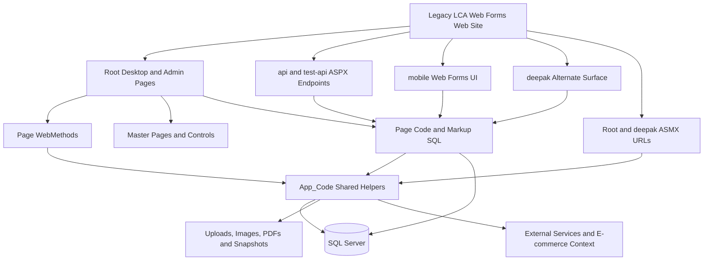

The central point is that there is no single controller, service, or repository layer through which every operation passes. Database access and side effects can originate from page markup, page code, callable methods, API pages, or shared helpers. Migration discovery must therefore follow the complete business action rather than one file.

## 5. Authentication, Session and Authorization Flow

### Current verified login flow

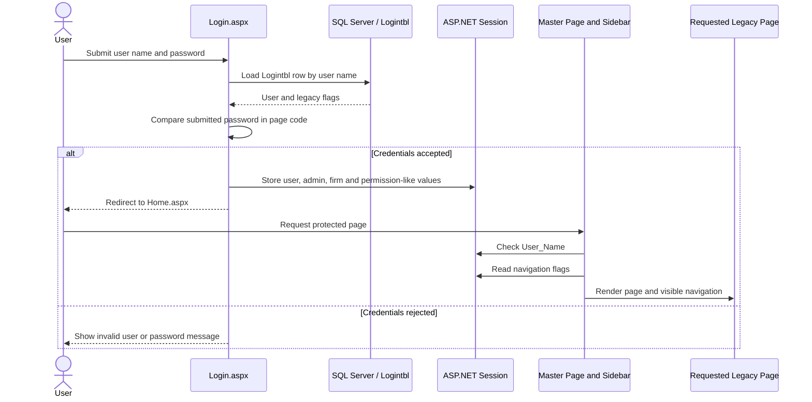

Normal login redirects to `Home.aspx`. Invitation login performs a similar lookup but redirects to `Invitation.aspx`. Logout calls `Session.Clear()` and returns to the login page. The source-configured session timeout is 60 minutes and uses the default in-process session provider unless deployment overrides it. **Verified / Needs Client / Production Confirmation**

### Current verified behavior

- `Login.aspx` selects a `Logintbl` row using a parameterized user-name query, then compares the submitted password in application code.
- Login copies user identity, admin status, firm information, page/capability flags, and other workflow values into ASP.NET Session.
- Both desktop master pages check `Session["User_Name"]` before rendering ordinary pages.
- The newer sidebar and older master use different permission flag sets to control navigation visibility.
- Three permission representations coexist: login/session flags, page-mapping rows, and group/area/customer permission rows.
- Some customer searches are filtered through area permissions.

### Issues and inconsistencies found

- Menu visibility is not a complete server-side authorization boundary.
- Static Page WebMethods are separately callable; the normal master/page lifecycle must not be assumed to protect them.
- Only three ASMX methods explicitly enable session, and the service has no common authorization check in the inspected source.
- Standalone output pages, mobile pages, and inspected ingestion/synchronization APIs have mixed or absent local checks.
- The intended precedence among the three permission representations is not established.
- Firm/tenant context is influenced by host names, `Mobile_FirmDetail`, `Logintbl.FirmID`, connection aliases, and sometimes request data; no single trusted mapping is proven.
- The restored `elinver.Logintbl` does not contain every column read by the login code, indicating that some configured database contexts differ from the restored schema.

> **Migration implication:** Existing System.Web session behavior must remain with the legacy application until an explicit identity and tenant handoff is approved. New APIs must enforce authorization independently rather than translating menu visibility into security rules.

## 6. Database Inventory

### Authoritative structural baseline

The following counts were reconciled from read-only metadata on the locally restored SQL Server `elinver` database. **Verified from Database**

| Database object | Verified count / observation |
| --- | ---: |
| User tables | 127 |
| Columns | 1,297 |
| Identity columns | 80 |
| Primary-key constraints | 92 |
| Tables without a declared primary key | 35 |
| Composite primary keys | 2 |
| Declared foreign keys | 6 |
| Indexes, including PK indexes | 101 |
| Non-PK indexes | 9 |
| Stored procedures | 38 |
| User-defined functions | 5: three scalar and two table-valued |
| User triggers | 1 |
| Views | **Needs Client / Production Confirmation**; the available baseline did not establish a view inventory |

All 127 observed tables are under the `dbo` schema. The restored database uses SQL Server 2022 and `SQL_Latin1_General_CP1_CI_AS` collation. The target database engine remains undecided; the PRD permits SQL Server or PostgreSQL.

### Simplified business-data map

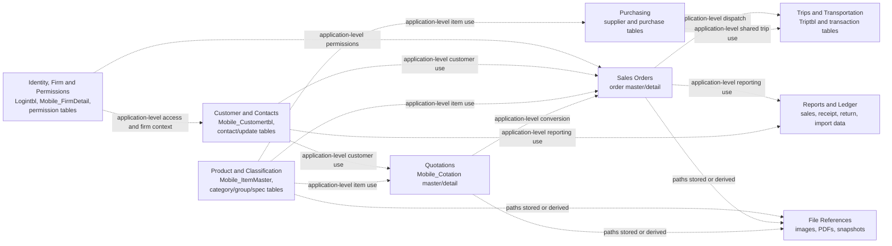

The dotted arrows are **application-level relationships**, established by code or procedure use. They are not represented as database-enforced foreign keys unless separately declared by SQL Server. This distinction is important because only six foreign keys exist across the observed schema.

### Important declared relationships

The six exported foreign keys include category/subcategory, trip/transportation, transaction/trip, and two unusual self-references. Three definitions have names or columns that appear counter-intuitive; they are retained as database evidence rather than silently “corrected.” No foreign key is declared for many important customer-contact, customer-order, item-category, item-order, quotation, or specification-map links.

### Structural migration considerations

- 35 tables lack a declared primary key.
- 1,194 of 1,297 columns are nullable.
- The schema is string-heavy, including fields that may represent dates, amounts, stock values, identifiers, or status values.
- Parallel generations of customer, product, order, purchase, quotation, import, and reporting structures coexist.
- Matching names such as `CustomerID`, `OrderID`, or `ItemCode` do not prove a relationship.
- Data profiling is required before adding constraints, converting types, or selecting a target schema.

## 7. Application → Database Mapping

| Application area | Representative pages / APIs | Principal tables or object families | Stored procedures / functions | Reads | Writes |
| --- | --- | --- | --- | :---: | :---: |
| Authentication and firm context | Login pages, masters, `User.aspx`, firm pages | `Logintbl`, `Mobile_FirmDetail`, permission tables | No identity procedure observed | Yes | User/permission administration only |
| Product and catalogue | Product/category/edit/mapping/import pages | `Mobile_ItemMaster`, category/group/type/unit/specification tables, e-commerce product/category objects | `sp_InsertUpdateItemMaster`, pricing/split/catalog routines | Yes | Yes |
| Customer and contacts | Customer/contact/invitation/import/history pages | `Mobile_Customertbl`, `Mobile_Contact`, `Mobile_ContactUpdate`, `Mobile_DeletedCustomer`, `DesignationMaster` | `sp_InsertUpdateCustomer`, `sp_getCustomerHistory` | Yes | Yes |
| Sales orders | New, legacy, barcode, completed, and output pages | Order master/detail, customer, item, price and carton data | `Sp_InsertNewOrder`, order item, pricing, listing and print procedures | Yes | Yes |
| Dispatch and transportation | `Home.aspx`, transportation/history/payment, evidence API | `TransactionDetail`, `Triptbl`, `transportationtbl`, order/customer/location data | Remaining-order and transportation procedures | Yes | Yes |
| Quotations / RFQ | Desktop quote pages and quotation APIs | Quotation master/detail, customer, item, firm/user, e-commerce product data | E-commerce SEO/output routines; direct SQL is significant | Yes | Yes |
| Suppliers and purchasing | Supplier, purchase, pending/completed, transport, API and output pages | `Mobile_Supplier`, purchase master/detail/transaction tables, shared trips | Purchase order CRUD, price, remaining, and print procedures | Yes | Yes |
| Reporting and ledger | Customer/item reports, history, outstanding, ledger and output pages | Orders, customers, items, receipts, returns, sales and import state | History and catalogue routines; many direct queries | Yes | Limited/dormant in mapped paths |
| Content and engagement | Blog, banner, reminder, marketing and hotel pages | `Blog`, `BlogCategory`, `Banner`, `DateReminder`, `WhatsappMarketing`, `WhatsappSend`, `HotelInfo` | Mostly direct SQL/markup CRUD | Yes | Yes |

The table intentionally lists important object families rather than every SQL statement. The key observation is that multiple entry points can read or write the same data, and replacing one screen does not automatically establish ownership of the underlying business state.

## 8. Stored Procedures, Functions and Triggers

Stored procedures and functions are SQL programs executed inside the database. A trigger is code SQL Server runs automatically after a table event. These objects matter because behavior can occur even when it is not visible in a page’s C# code.

### Functional grouping

| Area | Examples | Verified role |
| --- | --- | --- |
| Sales orders | `Sp_InsertNewOrder`, `sp_AddOrderItem`, `sp_UpdateOrderItem`, `sp_DeleteOrderItem`, `sp_getOrders`, `sp_ItemPriceUnitforOrder` | Order creation, item mutation, listing, and pricing support |
| Printing and fulfillment | `sp_getOrderforPrint`, `sp_getOrderforPrintCarton`, remaining-order and transportation procedures | Output and dispatch data |
| Purchasing | `PurchaseOrderInsert`, purchase item/list/price/print and remaining procedures | Purchase-order workflows |
| Customer and imports | `sp_InsertUpdateCustomer`, `sp_getCustomerHistory`, `sp_InsertUpdateRECEIVABLE`, area/transport/item import procedures | Import, customer history, and synchronization behavior |
| Category / utility | Category procedure family and split/JSON/location functions | Classification and reusable SQL transformations |

Complete definitions for the restored `elinver` programmable objects were retrieved during the final reconciliation. Older checked-in SQL exports are truncated and must not be used alone to reconstruct behavior.

### Verified trigger behavior

`dbo.tg_Mobile_ItemMaster` is the sole restored user trigger. It runs after updates to `Mobile_ItemMaster` and resets `IsImageSync` to `NULL` when one of the nine image columns changes. It uses `TOP (1)` from the inserted rows, so multi-row behavior requires characterization before a new writer changes or replaces it.

### Migration implications

- A new .NET path may temporarily retain a known procedure as a compatibility boundary.
- Procedure names are not reliable summaries of behavior; for example, `sp_InsertUpdateItemMaster` does not currently merge `Mobile_ItemMaster` in its restored definition.
- Database logic must be characterized with representative inputs, outputs, reads, writes, transaction behavior, and side effects before replacement.
- A trigger’s automatic effects must be included when comparing legacy and new writes.
- A procedure or trigger can be retired only after all callers and dependencies are verified.

## 9. External Integrations

### Integration inventory

| Integration | Purpose | Trigger / caller | Direction | Data exchanged | Current implementation | Confirmation status |
| --- | --- | --- | --- | --- | --- | --- |
| Legacy Firebase Cloud Messaging | Contact, dispatch, location, and product/category notifications | Customer, order, transport, and promotion paths | LCA → Firebase | Device registration and business metadata | HTTP helper in shared code | Call paths **Verified**; account, delivery, and active use need confirmation |
| Firebase Admin SDK | Permission, quotation, and import-related messages | User/permission and selected workflow paths | LCA → Firebase | Data messages | SDK plus service-account-file mechanism | Code **Verified**; deployed project and credentials need confirmation |
| SMS gateway | Invitations, order messages, and transport communication | Invitation, order, and trip history paths | LCA → SMS provider | Phone number and message | Synchronous HTTP calls | Code **Verified**; provider ownership, templates, retries, and receipts need confirmation |
| SMTP email | Import completion, purchasing, and transportation messages | Product import, purchase, and delivery flows | LCA → mail server | Operational text and PDF/image attachments | Synchronous SMTP calls | Code **Verified**; active accounts and monitoring need confirmation |
| WhatsApp task OTP endpoint | Send a task OTP after task data is updated | `api/GenerateTaskOtp.aspx` | LCA → third-party provider | Contact, template, and OTP data | HTTP POST with API-key mechanism | Code **Verified**; caller, provider, template, and delivery status need confirmation |
| WhatsApp marketing tables | Stage campaigns and recipients | `WhatsappMarketing.aspx` | UI → SQL Server | Recipient and optional image metadata | Database rows only | Staging behavior **Verified**; no sender/worker found |
| Google Maps and Roads | Display and snap transport location paths | Transportation browser pages | Browser → Google services | Coordinates and route data | Client-side JavaScript/API calls | Call sites **Verified**; key ownership, billing, and current use need confirmation |
| `HotelshopEstore` database | Product/category/specification mapping, catalogue output, quotation links, and device lookup | Product, quotation, catalogue, and notification paths | LCA ↔ separate SQL context | Product/category/customer/device data | Cross-database queries and procedures | Code use **Verified**; physical schema and production ownership need confirmation |
| Hospitality synchronization | Synchronize product/image/snapshot information | Hostname-gated Product path | Remote DB/site → LCA | Product media and data snapshots | Alternate connection plus HTTP downloads | Code path **Verified**; effective database and active use need confirmation |
| Remote product/content sources | Retrieve descriptions, specifications, images, and hotel data | Product enrichment and hotel pages | Remote sites → LCA | HTML, JSON, images, contact data | Source-specific parsers and HTTP clients | Code paths **Verified**; active/authorized providers need confirmation |
| Same-host PDF rendering | Generate purchase, quotation, ledger, and catalogue documents | Output workflows | LCA page → LCA page/converter | HTML page and PDF bytes | HiQPdf, NReco/wkhtmltopdf and related tools | Runtime artifacts **Verified**; deployed licensing, recursion, and reliability need confirmation |

### Integration context

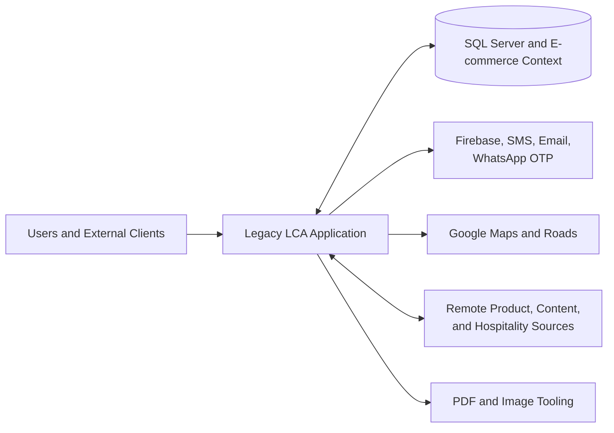

The source often performs a database write, file operation, and provider call in sequence without one transaction or durable delivery queue. A later failure can therefore leave only part of the business action completed. Production status and ownership must be confirmed per integration before moving its side effects.

## 10. File / Document Storage

### Verified storage dependencies

| Path family | Typical content | Business dependency |
| --- | --- | --- |
| `UploadedItems/`, `Thumbnail/`, `t-Thumbnail/` | Product uploads, images, thumbnails, workbooks, and exports | Database fields and downstream pages/clients use these paths |
| `UploadedItems/Invitation/` | Personalized invitation images | Contact state and SMS flows refer to generated images |
| `UploadedItems/XMLFile/RECEIVABLE.txt` | Receivable import snapshot | Order, purchase, and outstanding pages read it |
| `UploadedItems/TextFile/*.txt`, `all-data.zip` | Synchronization snapshots | Consumers and intended public exposure require confirmation |
| `images/placeImages/` | Generated sales and purchase images | Database status/path values and public consumers depend on filenames |
| `api/apiimg/` | Delivery signatures and LR evidence | Transaction rows and notification/email flows refer to files |
| `BillPDF/`, `LedgerPDF/`, `PurchaseOrderPDF/`, `CotationPDF/` | Generated business documents | Existing URL and naming patterns form compatibility contracts |
| `UploaderTemp/` | Temporary upload state | Legacy upload handler expects a writable directory |

### File lifecycle

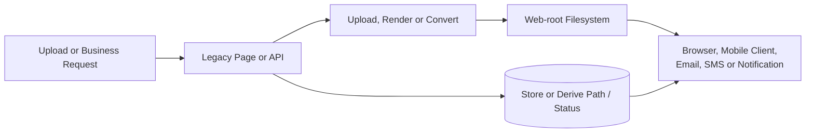

Some files are generated synchronously and then referenced by predictable public URLs or database fields. Database and file updates are not generally atomic. During coexistence, historical links, path conventions, access permissions, shared-disk behavior, and retention policies must remain intact until ownership is deliberately moved.

## 11. Important End-to-End Data Flows

### Authentication flow

The authentication order is shown in Section 5. The trigger is a normal or invitation login. `Login.aspx` or `LoginByInvitation.aspx` reads `Logintbl`, compares the password, populates session, and redirects. The resulting session feeds the desktop shells and permission-like navigation behavior. No external integration or generated file is involved in the verified login path.

### Sales order and generated image flow

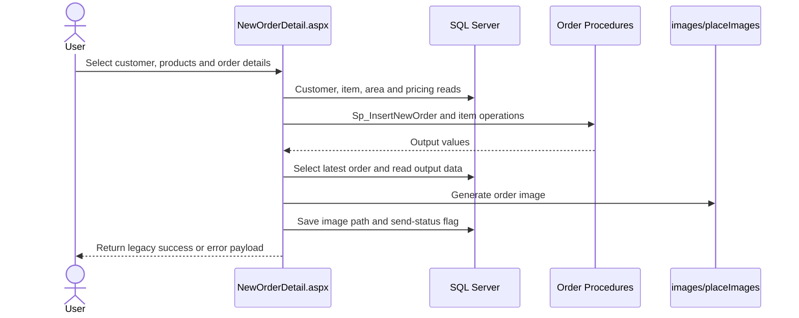

The intended result is a stored order plus a generated image. The current code ignores the returned order ID and selects the global latest order, creating a concurrency risk. The procedure, later reads, file generation, and status update do not form one transaction. This is a migration consideration, not behavior to reproduce blindly.

### Product maintenance and import flow

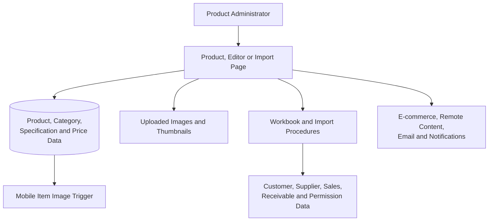

Product maintenance is broader than product CRUD. Some Product paths import customer, supplier, sales, contact, permission, and receivable data; create snapshots; synchronize images; and send notifications or email. A first Product API should separate the core product record from these import and integration workflows.

### Customer, contact, and invitation flow

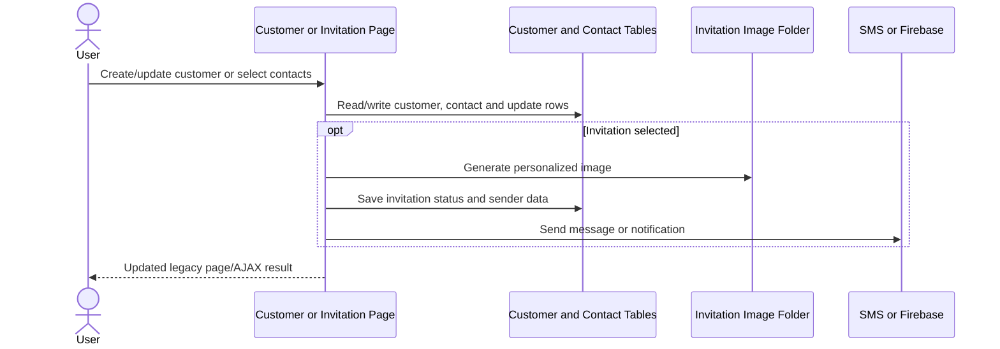

Customer information exists both in six fixed contact slots and in normalized contact/update tables. Orders, reports, permissions, imports, invitations, and history pages consume the data. The authoritative contact representation and downstream synchronization ownership require client/production confirmation.

### Quotation / RFQ flow

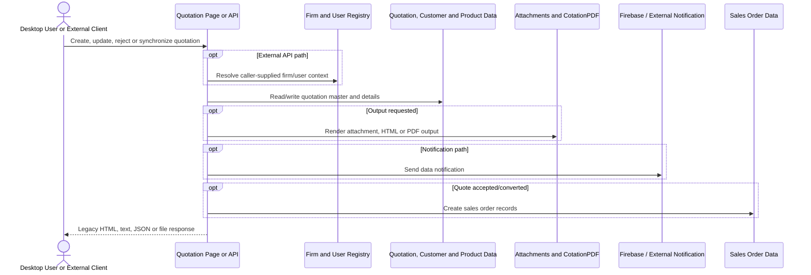

Quotation paths share customer, product, pricing, permission, e-commerce, file, and sales-order dependencies. External callers and their reliance on current request/response quirks are not visible in the repository.

### Purchase, trip, and document flow

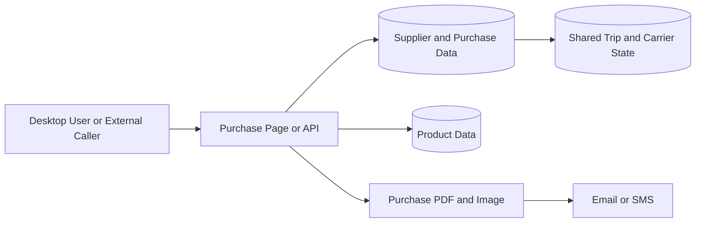

Desktop and API purchase creation use different write implementations but converge on purchase data and document paths. Purchasing shares trip/carrier state with sales fulfillment. PDF and email steps occur after database changes, so exactly one system must own the complete action during migration.

## 12. Legacy System Dependency Map

### Presentation view of the complete platform

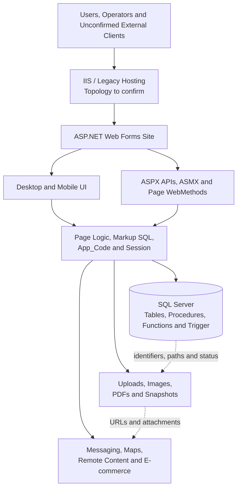

This is the main mental model for the current platform. Every visible application surface converges on shared logic, data, files, or integrations. The migration must preserve those dependencies until responsibility moves to the new platform capability by capability.

## 13. Key Legacy Risks / Technical Observations

| Observation | Why it matters during migration |
| --- | --- |
| Page, markup, shared-helper, and database logic are tightly connected | Replacing a UI page alone may leave writers and side effects elsewhere |
| Authentication and workflow state rely on System.Web Session | ASP.NET Core cannot assume it can read or share the legacy session cookie |
| Navigation visibility and direct authorization are inconsistent | New APIs require explicit server-side identity, permission, and tenant checks |
| Three permission representations coexist | Their intended precedence must be confirmed before mapping to a new policy model |
| Firm/database routing has several inputs and weakly constrained fields | Client-supplied or hostname-derived context cannot be treated as trusted tenancy by itself |
| Only six database foreign keys are declared | Logical relationships must be proven from code, procedures, data, or client knowledge |
| Business data has multiple readers and writers | One write owner per aggregate is required before switching a write route |
| Procedures and one trigger carry database behavior | SQL behavior must be characterized before moving it into .NET |
| Files and predictable public URLs are business contracts | A separate deployment can break images, PDFs, imports, and historical links |
| External calls often follow database writes synchronously | Retrying or running both systems can duplicate or partially complete side effects |
| Alternate and test-named implementations differ | Naming alone is not enough to retire a path |
| External consumers are not visible in the repository | Access logs and client ownership are required before changing routes or security contracts |

These observations are presented as migration constraints, not criticism. They reflect the system’s long operational history and explain why an incremental, evidence-led transition is appropriate.

## 14. What Is Verified vs What Still Needs Confirmation

### Verified from Source Code

- The legacy runtime is ASP.NET Web Forms on .NET Framework 4.8 using `System.Web`, ASP.NET Session, ASMX, ASP.NET AJAX, ADO.NET, and markup `SqlDataSource` controls.
- The grouped surface counts, two desktop shells, mobile and alternate areas, shared helpers, Page WebMethods, and ASMX methods are present in the inspected snapshot.
- Login, session population, navigation flags, logout behavior, and mixed enforcement boundaries are mapped.
- Product, Customer, Orders, Transportation, Quotations, Purchasing, Reporting, Content, file, and integration call paths are present.
- Multiple page families read and write shared database objects.
- Upload, image, snapshot, document, native conversion, and public path dependencies exist.
- Integration code exists for Firebase/FCM, SMS, SMTP, maps/roads, WhatsApp task OTP, e-commerce, remote content, and document conversion.
- Alternate/test/copy implementations can be materially different and cannot be declared obsolete from their names.

### Verified from Database

- Restored `elinver` contains 127 tables, 1,297 columns, 92 primary keys, six foreign keys, 101 indexes, 38 procedures, five functions, and one user trigger.
- All observed tables are under `dbo`.
- Thirty-five tables have no declared primary key and relationship coverage is sparse.
- Complete programmable-object definitions were retrieved from the restored database during reconciliation.
- The single trigger updates product image synchronization state after relevant image changes.
- Important Product, Customer, identity, permission, and lookup table keys and constraints have been reconciled.
- Many application-used logical links are not protected by declared foreign keys.

### Requires Production / Client Confirmation

- Production IIS sites, application boundaries, bindings, default documents, rewrites, proxies, load balancers, DNS, TLS termination, and canonical host names.
- Which root, `api`, `test-api`, `mobile`, `deepak`, ASMX, PageMethod, print, and document routes are actively used.
- External/mobile client identities, supported versions, payload expectations, and authentication arrangements.
- Effective production database connections, firm-to-host/user/database mapping, other configured databases, SQL jobs, linked servers, and cross-database ownership.
- Actual session provider, cookie domain/path/security settings, server affinity, and timeout overrides.
- Intended precedence of login flags, page mappings, and group/area/customer permissions.
- Canonical customer contact representation and identifier rules.
- Writable/shared file-storage topology, public URL mapping, ACLs, backup, retention, cleanup, and multi-server behavior.
- Provider accounts, operational ownership, credentials rotation, current templates, quotas, retries, and delivery status for external services.
- Workers or scheduled processes that consume `WhatsappSend`, synchronization snapshots, reminders, or other repository-created records/files.
- Which remote product/content sources remain active and authorized.
- The final target database engine and future data model.

> **Key takeaway:** Phase 1 has produced a strong source-and-database understanding of the application. The remaining gaps are primarily production topology, active consumer, operational ownership, and business-policy confirmations—not reasons to restart repository discovery.

---

## Evidence Basis

This client document was synthesized from the repository scope and documentation guide, the supplied PRD, the target architecture and migration strategy, the initial strangler plan, the Sprint 1 foundation record, the Phase 1 discovery closeout, the final restored-database reconciliation, the master application/database/repository maps, and the checked-in SQL Server structural exports. Restored live metadata takes precedence over older truncated database exports. No credential values, connection strings, tokens, service-account content, or sensitive business records are reproduced.
