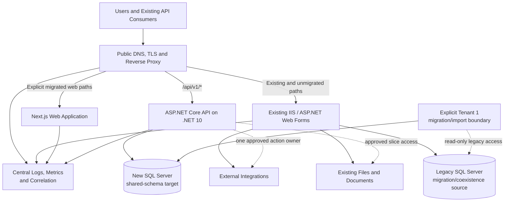
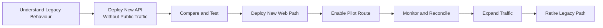
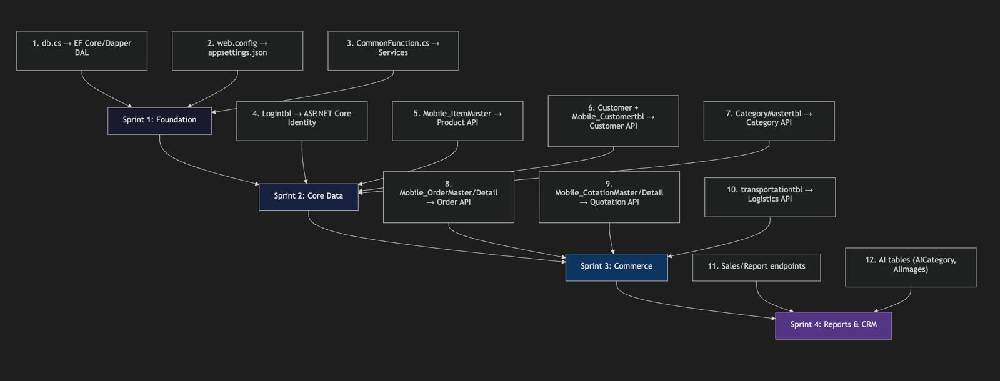

# LCA Platform Modernization — Strangler Migration Plan

## Purpose

This document explains how LCA moves from the existing ASP.NET Web Forms application to the new Next.js and ASP.NET Core platform without replacing everything in one high-risk release. It describes coexistence and cutover procedure; current implementation status is recorded in `.agents/codex/02-CURRENT-STATE.md`.

The core approach is simple:

> Keep the existing application running, deploy the new application beside it, and move one complete business capability at a time through explicit reverse-proxy routes.

The legacy application remains the fallback until each migrated capability has been tested, reconciled, monitored, and accepted.

## 1. Migration Approach

Today, the existing Web Forms application handles the website, legacy APIs, login session, business logic, SQL Server access, files, and external integrations.

During migration, both the old and new applications will be deployed:

- the existing ASP.NET Web Forms application;
- the new Next.js web application;
- the new ASP.NET Core API;
- one reverse proxy or application gateway in front of them.

Users continue to access one public domain. The reverse proxy examines the request path and sends it to the correct application.

```text
Existing or unmigrated route  -> Legacy Web Forms
Migrated web route            -> Next.js
New /api/v1 route             -> ASP.NET Core
Unknown route                 -> Legacy Web Forms by default
```

This is how the new platform gradually replaces, or “strangles,” the old platform without requiring one complete cutover.

## 2. Deployment Architecture During Migration



The reverse proxy is the public entry point for both frontend pages and backend API requests. The browser does not need to know the internal server names or ports. Normal `/api/v1` runtime requests use the new target database; legacy database access is limited to explicit, offline or compatibility-boundary migration work.

Example internal deployment addresses might be:

```text
legacy-iis:80
nextjs:3000
lca-api:8080
```

Users only see the public address:

```text
https://lca.example.com
```

The exact reverse-proxy product will be selected after confirming the production hosting topology. It could be IIS URL Rewrite with Application Request Routing, Nginx, YARP, an existing load balancer, or a cloud application gateway.

## 3. Reverse-Proxy Routing Rules

The routing policy must be explicit and use the legacy application as the default destination.

| Public request | Destination during coexistence | Reason |
| --- | --- | --- |
| `/api/v1/*` | ASP.NET Core API | Reserved versioned boundary for new APIs |
| Explicit migrated paths such as `/catalogue/*` | Next.js | Only accepted new web capabilities move here |
| Existing `.aspx`, `.asmx`, and PageMethod routes | Legacy Web Forms | Existing contracts remain unchanged |
| Existing legacy API paths, including `api/*.aspx` | Legacy Web Forms | Prevent accidental capture by the new API |
| Existing image, upload, PDF, and document paths | Existing owner/storage | Preserve historical links during migration |
| Any unmatched route | Legacy Web Forms | Unmigrated functionality remains operational |

A broad rule such as `/api/* -> ASP.NET Core` must not be used because the legacy application already has API paths under `/api/`. The new boundary is the more specific `/api/v1/*` prefix.

### Illustrative reverse-proxy configuration

The final syntax depends on the selected hosting product, but the routing behaviour should be equivalent to this example:

```nginx
# New versioned APIs go directly to ASP.NET Core.
location ^~ /api/v1/ {
    proxy_pass http://lca-api:8080;
}

# Add only web paths that have completed migration acceptance.
location ~ ^/(catalogue|products)(/|$) {
    proxy_pass http://nextjs:3000;
}

# All remaining routes stay on the existing application.
location / {
    proxy_pass http://legacy-iis;
}
```

This is an example of the required routing behaviour, not a decision to use Nginx. If IIS ARR or a cloud gateway is used, the same route priorities and fallback rule must be configured there.

### Request examples

```text
GET /Product.aspx
  Reverse proxy -> Legacy IIS

GET /catalogue
  Reverse proxy -> Next.js

GET /api/v1/products
  Reverse proxy -> ASP.NET Core

GET /some-unmigrated-page
  Reverse proxy -> Legacy IIS
```

## 4. How the Frontend Reaches the API

The Next.js frontend should call a stable relative public path:

```ts
fetch("/api/v1/products");
```

It should not contain a production server address such as:

```ts
fetch("http://new-api-server:8080/api/v1/products");
```

When a user opens `https://lca.example.com/catalogue`, the relative API request becomes:

```text
https://lca.example.com/api/v1/products
```

The request returns to the reverse proxy, which sends it to the internal ASP.NET Core deployment:

```text
Browser -> https://lca.example.com/api/v1/products
        -> Reverse proxy
        -> http://lca-api:8080/api/v1/products
```

Moving the API to another server, adding API instances, or rolling back a route should therefore require a routing or deployment-configuration change—not a frontend source-code change.

The repository's Next.js configuration currently supports an internal API rewrite for local or separate-host development. In the shared production architecture, routing `/api/v1/*` directly from the front door to ASP.NET Core is the preferred path because it avoids an unnecessary Next.js hop.

## 5. What Is Deployed

During coexistence, the following deployment units remain independently releasable:

| Deployment unit | Responsibility |
| --- | --- |
| Legacy IIS application | All existing and unmigrated pages, sessions, APIs, files, and business actions |
| Next.js application | Only migrated web experiences |
| ASP.NET Core application | Secured `/api/v1/*` APIs and migrated business capabilities |
| Reverse proxy/application gateway | TLS, routing, health checks, access logging, activation, and route rollback |
| Legacy SQL Server | Legacy application data and migration/coexistence evidence; not normal new-platform runtime persistence |
| New SQL Server | Authoritative persistence for migrated target capabilities, using one shared schema and TenantId enforcement |
| File/document storage | Existing paths until each file-owning capability is explicitly migrated |

The repository already contains an ASP.NET Core Dockerfile, health endpoints, versioned API routes, a Next.js standalone build configuration, relative frontend API calls, authorization policies, tenant context, correlation identifiers, and structured logging.

Production reverse-proxy configuration, the production Next.js hosting definition, identity coexistence, centralized monitoring, and exact route mappings still need to be completed after the production environment is confirmed.

## 6. How One Capability Is Migrated

Every capability follows the same deployment lifecycle.



### Step 1 — Understand the existing capability

Identify its pages, APIs, database objects, permissions, tenant/firm rules, files, integrations, callers, outputs, and side effects.

### Step 2 — Deploy the new API without public traffic

Deploy the ASP.NET Core capability and expose it only to internal testing or an approved preview environment. Legacy production traffic remains unchanged.

### Step 3 — Compare with legacy behaviour

Compare responses, validation, authorization, tenant isolation, database results, files, and business outcomes. Read operations may be compared in parallel. Production write operations must not be duplicated.

### Step 4 — Deploy the new web experience

Deploy the Next.js page behind a preview path or server-side feature flag. The new page calls the stable `/api/v1/*` contract.

### Step 5 — Enable a controlled pilot

Activate the new page and API for an approved route, tenant, or user group. Tenant-based activation must use trusted authenticated context, not a caller-supplied tenant identifier.

### Step 6 — Monitor and reconcile

Review errors, latency, authorization failures, database changes, files, integration effects, and business-level differences.

### Step 7 — Expand traffic

Move additional users or the canonical route only after the pilot is accepted.

### Step 8 — Retire the legacy path

Disable the legacy implementation only after all required callers have moved and the observation period has completed without critical unexplained differences.

## 7. Product Migration Example

Product demonstrates how the plan works in practice.

### Before migration

```text
/Product.aspx       -> Legacy IIS
/api/product.aspx   -> Legacy IIS
```

### Preview deployment

```text
/Product.aspx                 -> Legacy IIS
/migration-preview/products   -> Next.js
/api/v1/products              -> ASP.NET Core
```

The new Product API persists to the new shared-schema SQL Server database and is compared against representative legacy Product behaviour. The explicit Tenant 1 catalog importer reads the legacy database without modifying it and reconciles Products, Categories, Pricing, Inventory, and legacy media references before target use. Product images, item identifiers, price and stock visibility, the existing image trigger, tenant visibility, imports, and other consumers must be included in the comparison.

### Controlled activation

After acceptance, the routing or navigation configuration can expose the new experience:

```text
/products          -> Next.js
/api/v1/products   -> ASP.NET Core
```

The old Product path remains available temporarily for rollback. The new Product page continues calling `/api/v1/products`; it does not need to know the ASP.NET Core server address.

### Rollback

If a serious issue appears, disable the new Product activation and return users to the legacy Product route. This routing rollback is safe only if database records, identifiers, files, and trigger effects remain compatible with the legacy application.

## 8. Migration Sequence



The migration sequence below reflects the current capability order. The original sprint labels are historical planning labels, not a claim about calendar delivery dates:

| Stage | Migration work | Current status |
| --- | --- | --- |
| Foundation | Controlled database access, environment configuration, shared services, authentication, authorization, trusted tenant context, and shared-schema SQL Server persistence | Implemented and locally verified |
| Core Data | Product, Category, Pricing, Inventory, Customer, contacts, Tenant 1-only importers, and minimal tenant administration UI | Implemented locally; production cutover remains separate |
| Platform administration | Platform Owner login, dashboard aggregates, Tenant lifecycle, Tenant-user provisioning/status, account recovery, and platform audit | First slice implemented and locally verified |
| Next business slice | Sales/Orders, then Quotations and Logistics | Not implemented; requires new characterization and approval gates |
| Later reporting/CRM | Sales/report endpoints and required CRM reads | Deferred |

The diagram's AI-table box is a downstream compatibility reference. AI implementation remains outside the current implementation scope unless it is explicitly reopened.

A later sprint cannot bypass authentication, tenant isolation, legacy characterization, reconciliation, or rollback preparation simply because an earlier capability is delayed.

## 9. Database Coexistence

The legacy and target databases remain separate during coexistence. The legacy SQL Server remains authoritative only for capabilities that have not yet cut over. For an implemented target slice, the new SQL Server is the target persistence authority after migration/reconciliation and explicit ownership acceptance.

```text
Legacy Web Forms ---------> Legacy SQL Server
                                |
                                | read-only migration boundary
                                v
ASP.NET Core -------------> New SQL Server
                             shared schema + TenantId
```

The importer or compatibility boundary may read legacy data for profiling, migration, and reconciliation. Normal target APIs do not call legacy tables at runtime. The legacy application and new platform must not independently perform the same production business write.

The rules are:

1. One writer owns each aggregate or business action.
2. Do not introduce automatic dual writes.
3. Preserve identifiers and backward compatibility while rollback depends on legacy.
4. Retain characterized stored procedures or trigger behaviour where safer than incomplete reimplementation.
5. Reconcile counts, identifiers, totals, rejected rows, samples, and business outcomes for every moved area.
6. The target database is the approved new SQL Server shared-schema database; do not introduce another engine or per-tenant database without an explicit architecture decision.

Moving business logic to ASP.NET Core and moving data to the new database remain separate migration activities, but the target engine and tenancy model are already decided: one new shared-schema SQL Server database with TenantId-scoped persistence.


## 10. Activation, Monitoring, and Rollback

Deployment and activation are separate:

```text
New code deployed       = yes
Public route activated  = no
```

After health and acceptance checks, the route or server-side feature flag is activated. Monitoring must show:

- exact route and capability;
- legacy or new implementation;
- tenant/firm context without sensitive values;
- request result, latency, and failure class;
- reconciliation result;
- file or integration outcome;
- deployment and activation version.

Read-only rollback may be a route or feature-flag change. Write-owning rollback also requires confirmation that the legacy application can understand all data and files created by the new implementation. A proxy switch cannot undo database writes, generated files, sent messages, or provider calls.

## 11. Production Infrastructure Required

The coexistence deployment requires:

- public DNS and TLS termination;
- a reverse proxy or application gateway;
- the existing IIS/Web Forms deployment;
- a production Next.js deployment;
- a production ASP.NET Core deployment;
- health checks and load-balancer behaviour;
- secure environment configuration and secret management;
- approved network access to SQL Server;
- compatible file/document storage;
- centralized logs, metrics, alerts, and correlation;
- controlled route or feature activation;
- independent deployment pipelines;
- database backup and recovery procedures;
- a production-like staging environment containing both old and new applications.

Before final production configuration, confirm the existing IIS topology, DNS and TLS ownership, current load balancer or proxy, session storage, active legacy routes and external callers, file-storage topology, container support, monitoring platform, and identity coexistence approach.


> The migration is controlled through deployment, routing, ownership, and evidence: deploy both platforms, activate only explicit routes, move one complete capability at a time, reconcile the result, and retain the legacy fallback until the new path is demonstrably safe.
