# LCA Platform Modernization — Strangler Migration Plan

## Purpose

This document explains how LCA will move from the existing ASP.NET Web Forms platform to ASP.NET Core/.NET 10 without requiring a single high-risk replacement event. It defines the finalized migration architecture, the coexistence rules, and the lifecycle used to move individual business capabilities.

It also distinguishes architectural decisions that are complete from production implementation details that still require client or operational confirmation.

### Evidence labels used in this document

| Label | Meaning |
| --- | --- |
| **Verified** | Supported by the current repository, legacy discovery, or restored SQL Server evidence. |
| **Inferred / Recommended** | A migration choice derived from the verified dependency map but not yet an approved production sequence or product decision. |
| **Approved Target Requirement** | A client-approved target priority or delivery constraint; implementation and cutover still require evidence gates. |
| **Needs Client / Production Confirmation** | Requires business, deployment, access-log, provider, or production-infrastructure evidence. |

## 1. Executive Summary

LCA will be modernized by placing new functionality alongside the existing application and moving responsibility one business capability at a time.

An everyday analogy is renovating a working building one area at a time. The occupied areas remain open. A renovated area is inspected, compared with the original requirements, and opened only when it is safe. If a problem appears, users can return to the existing area while it is corrected.

For LCA, this means:

1. the current ASP.NET Web Forms application remains operational;
2. new Next.js and ASP.NET Core functionality is introduced on clearly separate routes;
3. each migration slice includes its user/API entry point, authorization, business logic, data behavior, files, and external side effects;
4. legacy and new results are compared and reconciled;
5. traffic is moved only after acceptance criteria and rollback are proven;
6. the corresponding legacy path is retired only after a stable observation period.

This approach reduces risk because a defect in one migrated capability does not require the entire platform to be rolled back. It also allows database behavior, permissions, tenant/firm isolation, files, and integrations to be validated before ownership changes.

> **Key takeaway:** The legacy and new systems will run side by side. LCA will replace complete business capabilities one at a time, not replace the whole platform in one cutover.

## 2. Why We Are Using the Strangler Pattern

The approach directly addresses the conditions found during LCA discovery:

- The existing system must remain available while modernization proceeds.
- Business logic is distributed across pages, markup, shared helpers, SQL procedures, one database trigger, files, and provider calls.
- Product, Customer, Orders, Quotations, Purchasing, Reports, and Transportation share identifiers and data.
- ASP.NET Core cannot assume it can read the existing System.Web session.
- Existing page APIs, ASMX methods, Page WebMethods, public files, and external callers may depend on legacy URLs and response formats.
- The restored database has few declared foreign keys, so application-level dependencies must be verified before data ownership moves.
- A capability-level switch can be reversed more safely than a platform-wide cutover.

A big-bang replacement would require all these dependencies to be correct at once. The strangler approach isolates them into smaller, testable decisions and retains the known legacy path while each new slice is proven.

## 3. Current vs Target Architecture

### Current state

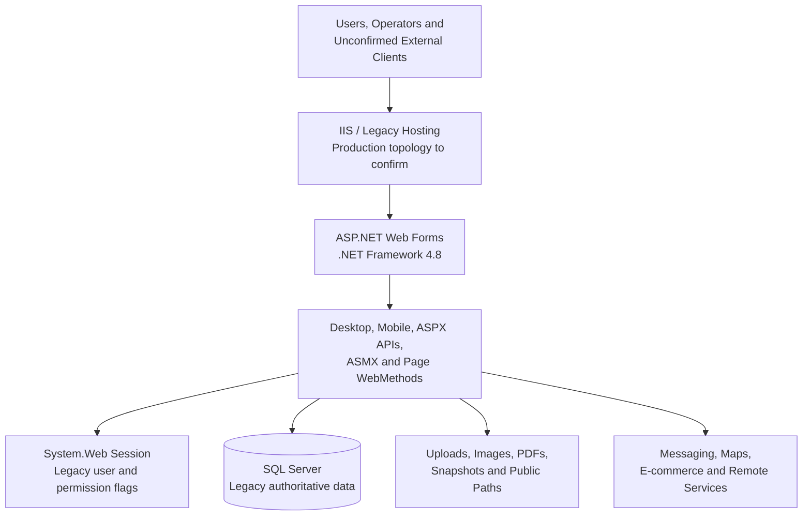

Today, the Web Forms application owns existing routes, session behavior, business writes, generated files, and integration calls. The production hosting shape and active external clients are not proven by repository evidence and must be confirmed before routing changes.

### Target state

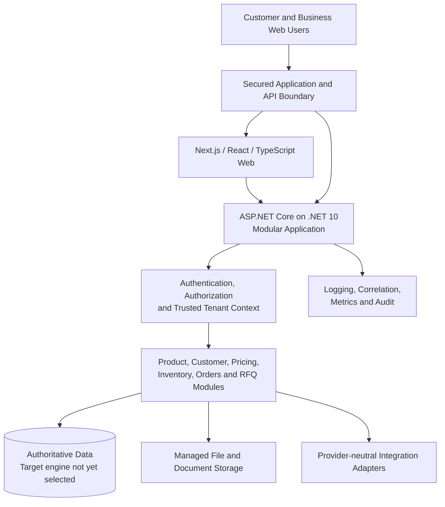

The approved target direction is a modular ASP.NET Core application, not a default fleet of microservices. `Lca.Api` provides the HTTP host and composition, `Lca.Core` contains implemented application behavior and security/tenancy abstractions, and `Lca.Infrastructure` will contain persistence and provider implementations as slices are introduced. **Verified target direction**

The exact target database engine, production gateway/proxy product, file-storage product, and identity bridge are not finalized. Redis, a separate search engine, event buses, and independently deployed workers are possible future components only when a migrated capability justifies them; they are not prerequisites or commitments in this Phase 1 plan.

## 4. Strangler Coexistence Architecture

### Primary coexistence architecture

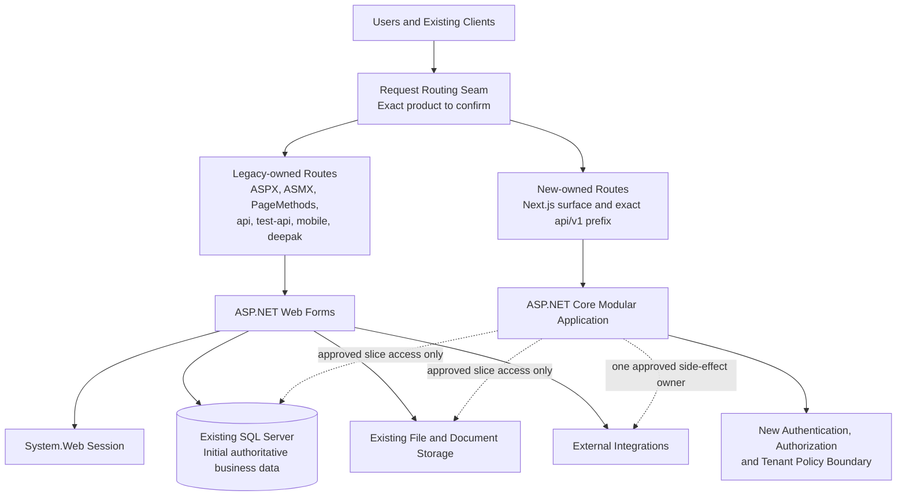

During migration, both applications run simultaneously. Routing selects the implementation for a specific URL or capability; it does not randomly split a single write action between both systems. Capabilities not yet migrated continue to use the legacy application and its session, data, files, and integrations.

The initial route boundary is already defined: existing legacy URLs remain unchanged, while new foundation endpoints use `/api/v1/*` and the new web surface is hosted separately. A broad `/api/*` rule is prohibited because it would capture the legacy ASPX endpoints under that prefix. The reverse-proxy or routing product used in production remains an implementation decision.

### Initial ownership during coexistence

| Concern | Initial owner | Evidence state |
| --- | --- | --- |
| Existing `.aspx`, `.asmx`, and Page WebMethod URLs | Legacy application | **Finalized architectural decision** |
| Existing `api/*.aspx`, `test-api`, `mobile`, and `deepak` routes | Legacy application | **Finalized architectural decision** |
| Existing login/logout and System.Web session | Legacy application | **Finalized architectural decision** |
| Existing business state and database writes | Legacy application/database | **Finalized until a slice assigns a new owner** |
| Existing procedures, trigger behavior, imports, files, and public URLs | Legacy application/database/storage | **Finalized until characterized and reassigned** |
| New `/health/*` and `/api/v1/*` foundation routes | ASP.NET Core | **Verified current implementation** |
| New web foundation surface | Next.js | **Verified current implementation** |

## 5. Request Routing Flow

### Route selection during migration

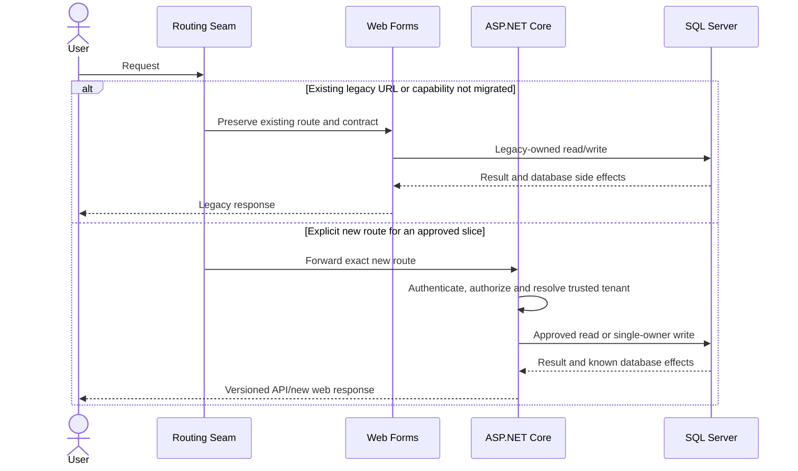

The architectural seam is finalized even though the production routing technology is not. Suitable implementation mechanisms could include an existing IIS routing capability or another reviewed reverse proxy, but this document does not select one without the production topology.

Every route mapping must be explicit and reviewable. Route activation requires the affected consumers, authentication behavior, firm mapping, data ownership, storage behavior, monitoring, and rollback procedure to be known.

## 6. Migration Unit

Migrating “module by module” means moving a complete, bounded business capability or vertical slice—not moving random classes, pages, or tables.

### LCA migration slice

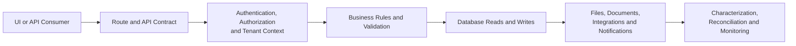

A slice is complete only when all applicable parts above are understood and assigned. For example, Product is not migrated merely because a new product-edit form saves `Mobile_ItemMaster`. The slice must account for item identifiers, classifications, pricing/stock visibility, image fields and trigger behavior, tenant visibility, public image paths, and the legacy consumers that still read the product.

Similarly, a Customer slice must decide how `CustomerID`, `Account_no`, fixed contact slots, normalized contacts, delete/sync signals, permissions, imports, orders, reports, and invitations remain compatible.

## 7. Module Migration Lifecycle

### Lifecycle for every capability

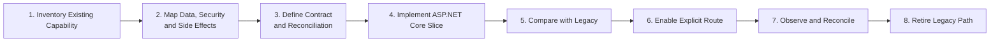

1. **Inventory existing capability:** confirm active entry points, callers, outputs, errors, and alternate implementations.
2. **Map dependencies:** identify authoritative data, permission/tenant rules, procedures, trigger effects, files, integrations, and other readers/writers.
3. **Define contract and reconciliation:** specify the new route and response, preserved identifiers, comparison queries, acceptance criteria, and rollback.
4. **Implement the target slice:** add the smallest modular .NET behavior and frontend/API path without taking unrelated ownership.
5. **Compare with legacy:** run characterization, integration, authorization, tenant-isolation, file, and reconciliation checks.
6. **Enable the explicit route:** move only the approved URL or use case; leave unrelated legacy paths untouched.
7. **Observe and reconcile:** distinguish new and legacy traffic, compare results, review errors, and validate side effects.
8. **Retire the legacy path:** disable only after acceptance, a stable observation period, and confirmation that no required caller remains.

## 8. Migration Sequence / Wave Plan

The following is the **Approved Target Requirement** for implementation priority. The order is fixed; the date or cutover of an item can still be held when its evidence gate is unmet. Holding a blocked slice does not authorize a later dependent slice to bypass authentication, tenant isolation, characterization, or reconciliation.

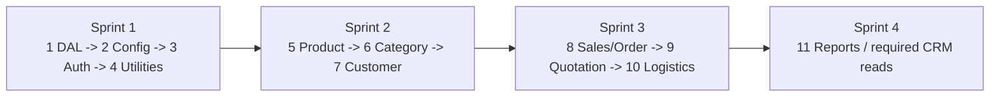

| Priority | Sprint / capability | Why this order | Major dependencies / confirmation gates | Legacy remains active? |
| --- | --- | --- | --- | --- |
| 1 | Sprint 1 — Database access layer | Every migrated API needs a controlled persistence boundary | `db.cs` is not universal; verify direct SQL, procedures, connection aliases, firm routing, and provider isolation; EF Core/Dapper choice may be per use case | Yes, entirely |
| 2 | Sprint 1 — Configuration | Database and provider behavior needs validated environment-specific configuration | Map `web.config` settings by meaning; use options validation and external secrets; do not copy credentials | Yes, entirely |
| 3 | Sprint 1 — Authentication, authorization, and tenant context | Business APIs must be secured before exposure | Authoritative identity database, credential profile/reset or rehash path, permission mapping, firm entitlement, JWT contract, cross-tenant tests | Yes for legacy login/session and routes |
| 4 | Sprint 1 — Shared utilities | Later order/customer workflows need selected notification/crypto behavior | Split `CommonFunction.cs` by responsibility; identify callers, files, providers, retries, secrets, and one side-effect owner | Yes for unclaimed workflows |
| 5 | Sprint 2 — Product API | Highest-priority blocker and base data for commerce consumers | `Mobile_ItemMaster`, image trigger/files, price/stock visibility, sync/import consumers, stable `ItemCode`, reconciliation | Yes until reads/writes are individually accepted |
| 6 | Sprint 2 — Category API | Required with Product by the end of Sprint 2 | `CategoryMastertbl`, applicable subcategory/lookups, unusual declared self-FK, e-commerce mappings, tenant visibility | Yes until individually accepted |
| 7 | Sprint 2 — Customer API | Required for customer-scoped queries after Product/Category | `Customer` versus `Mobile_Customertbl`, `CustomerID`/`Account_no`, PII visibility, contact authority, delete/import/sync signals | Yes until individually accepted |
| 8 | Sprint 3 — Sales / Order APIs | Required for sales analytics and depends on secured master-data contracts | Order master/detail and procedures, pricing, dispatch, IDs, documents, notifications, external consumers | Yes for unmigrated order paths |
| 9 | Sprint 3 — Quotation API | Depends on Product, Customer, pricing, and order-conversion behavior | External callers, firm authorization, PDFs/attachments, quote-to-order conversion, notifications | Yes for unmigrated quotation paths |
| 10 | Sprint 3 — Logistics API | Depends on characterized order/fulfillment state | `transportationtbl`, trips/transactions, shared purchase/sales state, delivery evidence, provider side effects | Yes until the complete action is owned |
| 11 | Sprint 4 — Sales/report endpoints and required CRM reads | Reporting follows stable authoritative transactional APIs | Output contracts, tenant/customer visibility, aggregates, files, performance, reconciliation | Yes per report until accepted |

### Sequence principles

- Platform security and tenant/firm resolution precede business APIs.
- Read-only comparison precedes write ownership where practical.
- Product and Category precede Customer and are due by the end of Sprint 2; their files, lookups, imports, and sync behavior prevent simplistic CRUD replacement.
- Customer follows Product and Category; Sales/Order follows Customer.
- Orders, Quotations, and Transportation move only after the required master-data contracts are stable.
- High-risk document, import, remote-content, and messaging workflows are separate slices rather than hidden inside master-data CRUD.
- No wave requires redesigning all 127 tables or choosing microservices first.

AI systems are downstream consumers only for this repository plan. Product/Category may unblock a Product Onboarding Bot, Customer may unblock chatbot customer queries, and Sales/Order may unblock chatbot analytics, but AI agents and AI orchestration are not implemented here. The legacy `AICategory`, `AICategoryProductMapping`, and `AIImages` tables are not a scheduled API/module wave unless a separately approved compatibility need is established.

## 9. Database Coexistence Strategy

### Initial shared-database model

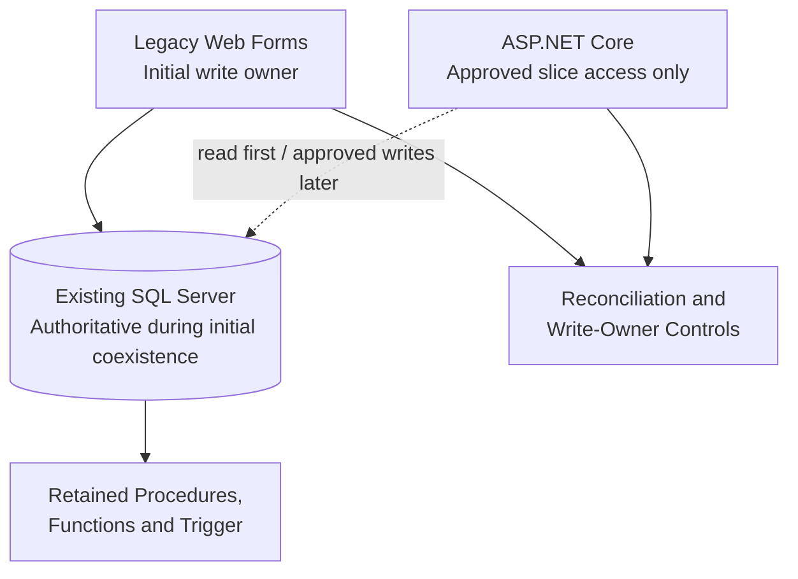

The existing SQL Server remains authoritative while the legacy application owns business writes. A new slice may first read from the same database to characterize behavior. It may write only after the affected aggregate has one explicit write owner and all required database, file, integration, and legacy-consumer effects are understood.

### Coexistence rules

1. **One writer per aggregate/action:** do not allow uncoordinated legacy and Core implementations to update the same business action differently.
2. **No automatic dual writes:** if transitional synchronization is ever required, it must be explicitly designed, idempotent, observable, reconciled, and reversible.
3. **Backward-compatible schema:** coexistence changes must preserve the columns, types, procedures, triggers, identifiers, and result shapes still used by legacy paths.
4. **Retain known SQL where safer:** a new .NET path may temporarily call a characterized legacy procedure rather than recreate incomplete behavior.
5. **Preserve trigger effects:** new Product writes must include the verified image-sync trigger behavior while it remains active.
6. **Preserve identifiers:** existing item, customer, order, quotation, supplier, trip, and file identifiers remain compatible until consumer and data profiling prove a safe transformation.
7. **Avoid broad redesign:** missing keys, sparse foreign keys, nullable fields, and string-heavy types are evidence to profile—not permission to normalize immediately.
8. **Reconcile every moved area:** compare row counts, rejected rows, identifiers, aggregates, orphans, conversion failures, samples, and business outcomes as applicable.
9. **Remove dependencies last:** a legacy table, column, procedure, trigger, or file path is retired only after all callers and rollback needs are cleared.

### Long-term data direction

The long-term platform will use an authoritative data layer behind secured APIs. The final database engine is not selected: the PRD allows SQL Server or PostgreSQL. Source-to-target transformation, constraint, and redesign decisions will be made per data area after profiling; this Phase 1 plan does not claim that every table will be immediately redesigned or copied into a second authoritative store.

## 10. Authentication and Session Coexistence

### Conceptual security boundary

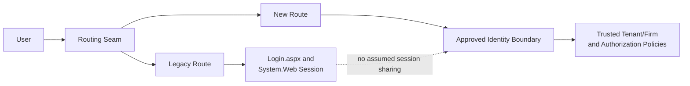

### Finalized architectural principles

- Legacy login, logout, session keys, redirects, and master-page behavior remain legacy-owned initially.
- ASP.NET Core does not assume it can consume the System.Web session or cookie.
- A request header, query parameter, body field, host name, or caller-supplied firm identifier is not trusted as tenant context by itself.
- Every new API must authenticate the caller, resolve tenant/firm context from an approved trusted source, and authorize the requested action server-side.
- Legacy menu flags are evidence to map, not the final target permission model.
- Cross-tenant access must be denied and tested.

### Implementation detail requiring validation

A later migration slice must choose one of two approved categories of approach:

- a trusted identity handoff from the legacy environment; or
- a separately authenticated ASP.NET Core boundary.

No specific SSO, token, cookie bridge, identity provider, or protocol has been approved by the current evidence. The decision requires the authoritative identity database, credential state, production cookie/session behavior, firm entitlement, permission intent, and client compatibility to be confirmed.

## 11. Integration Coexistence

### Side-effect ownership moves once

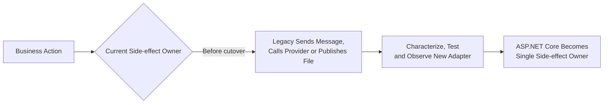

For one business action, exactly one system owns each external side effect. Legacy and Core must not both send the same SMS, email, push notification, WhatsApp request, PDF, remote update, or other provider call.

Before moving ownership:

- identify the real caller and provider owner;
- define authentication, timeout, retry, duplicate, and failure behavior;
- preserve provider references and required payload fields;
- make retries idempotent where possible;
- provide operational logging without exposing secrets or sensitive payloads;
- verify whether the database update and provider action need compensation or an outbox-style boundary;
- test that disabling the new route returns ownership cleanly to the legacy path.

The `WhatsappSend` tables are not treated as a verified WhatsApp delivery integration because no sender was found. Remote parsers and provider libraries are not treated as active merely because code or binaries exist.

## 12. File / Document Coexistence

### Shared path compatibility during transition

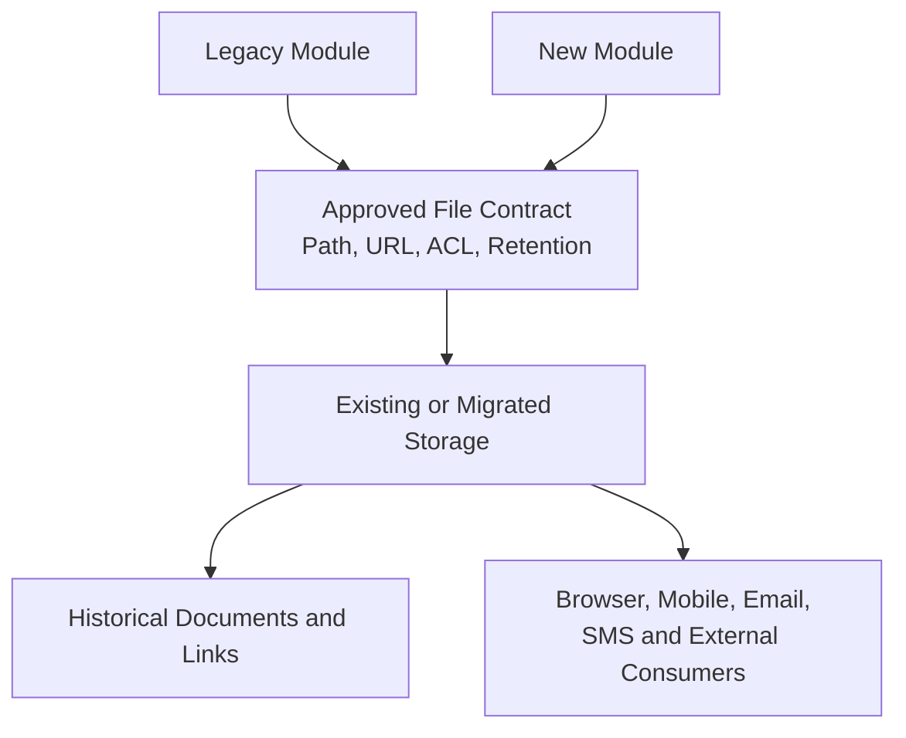

Existing images, uploads, PDFs, snapshots, and public URLs remain legacy-owned until their storage topology and consumers are verified. A migrated slice may read existing files through an approved compatibility mechanism, but it must not move or rename them without preserving historical links.

Before a new module generates or uploads files, the slice must define:

- canonical path and public URL behavior;
- whether storage is local, shared, or network-mounted in production;
- write/read permissions for both applications during coexistence;
- filename uniqueness and concurrent generation behavior;
- database path/status updates and failure recovery;
- retention, cleanup, backup, and sensitive-file exposure;
- native renderer, fonts, GDI, and same-host URL requirements where applicable.

Product images, invitation images, delivery evidence, receivable snapshots, and invoice/ledger/purchase/quotation documents should move as separate, testable file-owning capabilities when their parent business slice is ready.

## 13. Cutover Strategy Per Module

### Controlled capability transition

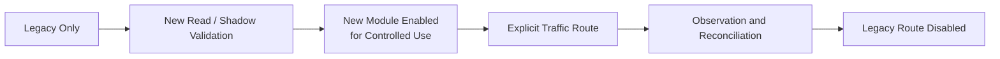

“Shadow” means comparing new behavior without allowing both implementations to perform the same external or database write. For reads, this can be parallel result comparison. For writes, validation should use controlled test data, retained procedure adapters, or replay in an isolated environment—not duplicate production side effects.

Traffic switches only when:

- callers and the exact route are known;
- the new contract is accepted;
- identity, authorization, and tenant/firm behavior are proven;
- database reads/writes and procedure/trigger effects reconcile;
- files and integrations have one owner;
- performance and operational visibility are acceptable;
- backward compatibility needed for rollback remains intact;
- the rollback action has been tested.

## 14. Rollback Strategy

### Module-level rollback

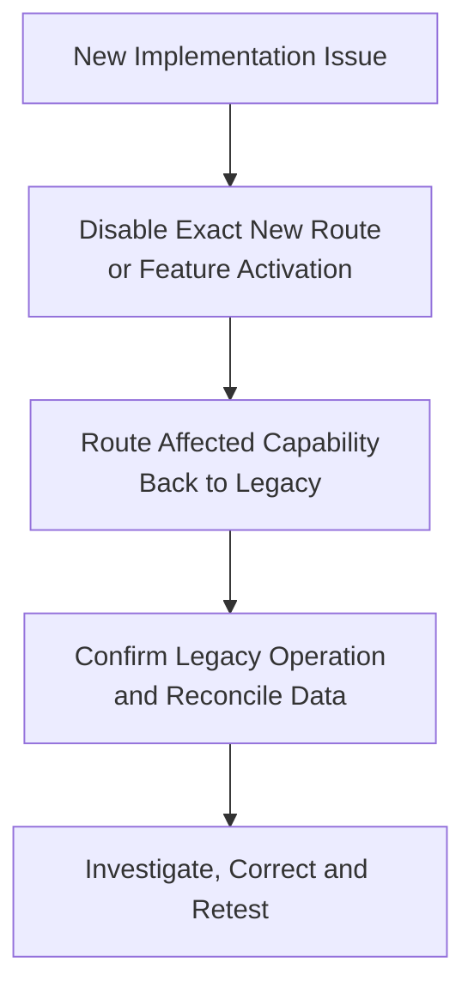

The Sprint 1 foundation has no business writes, so its rollback is simple: remove the explicit new-route mapping or stop the new containers while all legacy routes and state remain available.

Later write-owning slices require stronger rollback preparation. A route can return to legacy only if the data, schema, identifiers, files, and procedures remain backward compatible and the legacy code can understand all writes made by the new module. If a future transformation makes this impossible, rollback must use a separately designed data restoration/forward-fix plan and cutover must not proceed under the simpler routing rollback claim.

## 15. Validation Before Cutover

Each capability must meet the applicable checklist:

- [ ] Active legacy entry points, API consumers, and alternate implementations are identified.
- [ ] Required legacy behavior and intentional corrections are documented separately.
- [ ] New functionality matches the accepted route, request, response, validation, and error contract.
- [ ] Authentication and authorization are enforced server-side.
- [ ] Tenant/firm resolution uses a trusted mapping, and cross-tenant access tests are passing.
- [ ] Database reads and writes reconcile with representative legacy behavior and data.
- [ ] Stored procedure, function, and trigger effects are understood.
- [ ] One write owner exists for the affected aggregate/action.
- [ ] External calls are authenticated, idempotent where applicable, and owned by one system.
- [ ] Generated and historical files resolve correctly from all required consumers.
- [ ] Logs, correlation, metrics, errors, and audit evidence distinguish legacy from new behavior.
- [ ] Performance is acceptable for the intended production load.
- [ ] Backward compatibility required for rollback is preserved.
- [ ] Route enablement and rollback have been rehearsed.
- [ ] Reconciliation has no critical unexplained divergence.
- [ ] Business and technical acceptance are recorded before legacy retirement.

## 16. Observability During Migration

### Operational visibility

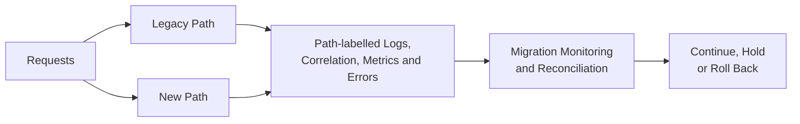

The new foundation already provides JSON console logging, correlation identifiers, health endpoints, and structured problem responses. **Verified current implementation** The production log/metrics platform, alerting thresholds, dashboards, retention, and ownership are not yet selected.

Monitoring must distinguish:

- the route and capability;
- legacy versus new implementation;
- tenant/firm context without exposing sensitive data;
- request outcome, latency, and failure class;
- database and reconciliation result;
- file or integration side-effect outcome;
- cutover version or activation state.

A page appearing to work is not sufficient. Migration decisions must use behavior comparison, data reconciliation, errors, latency, and side-effect evidence.

## 17. Risk Matrix

| Risk | Why it matters for LCA | Mitigation |
| --- | --- | --- |
| Hidden database coupling | Few declared FKs and distributed SQL mean a table may have unrecorded readers/writers | Trace application/procedure use per slice, profile data, characterize behavior, and reconcile before ownership changes |
| Session incompatibility | ASP.NET Core cannot assume access to System.Web session state | Keep legacy session ownership; approve a trusted handoff or separate authentication boundary |
| Untrusted firm/tenant selection | Host, text fields, connection aliases, and caller input participate in legacy routing | Confirm firm/user/database mapping and derive tenant context only from trusted authenticated evidence |
| Inconsistent legacy authorization | Menu visibility and page lifecycle do not uniformly protect direct methods/APIs | Enforce explicit Core policies and add authorization plus cross-tenant tests |
| Duplicate integration side effects | Both applications could send the same message, document, or provider request | Assign exactly one owner per action; use idempotency and operational tracking where applicable |
| Legacy file dependencies | Paths are stored in rows and embedded in messages, emails, and public links | Confirm storage topology and preserve path/URL compatibility until file ownership moves |
| Unknown external callers | API/ASMX/PageMethod consumers are not all present in the repository | Use production access logs and client ownership confirmation before contract or route changes |
| Alternate implementations | Test-, copy-, or numbered paths can differ and still have callers | Compare code and usage; never retire by filename alone |
| Stored procedure/trigger divergence | Reimplementing only visible page code can omit database behavior | Use complete restored definitions, characterization tests, and retained SQL adapters where safer |
| Partial multi-step actions | DB, file, and provider operations are often not one transaction | Define failure states, compensation/retry, reconciliation, and one action owner |
| Routing/cutover failure | An overly broad rule could capture legacy APIs or files | Use exact reviewed routes, health checks, monitoring, and rehearsed removal/rollback |
| Premature schema redesign | Nullable/string-heavy data and sparse constraints may contain unexpected values | Profile actual values and preserve backward compatibility before type/constraint changes |

## 18. Final Migration Architecture Diagram

### LCA modernization from today to completion

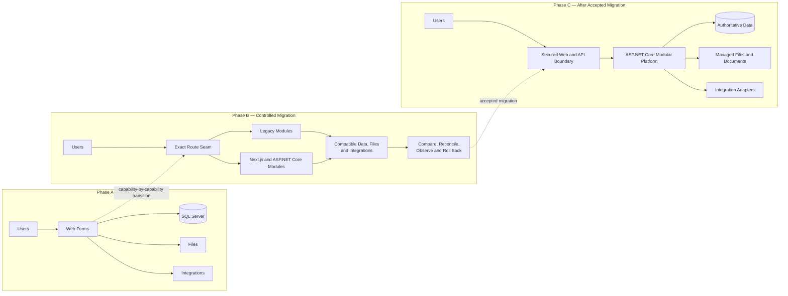

Phase A is the current legacy architecture. Phase B is the strangler period: each request is routed deliberately, both platforms coexist, and shared dependencies remain compatible while ownership moves. Phase C is reached only after each required capability has passed validation and its legacy equivalent has been retired.

The diagram does not imply that all database tables, files, or integrations change technology at the same time. Data and technical modernization remain incremental and evidence-led.

## 19. What “Finalized Strangler Plan” Means

### Finalized Architectural Decisions

- LCA will use incremental strangler modernization rather than a big-bang rewrite.
- The legacy application remains operational while capabilities migrate.
- Migration units are complete business capabilities/vertical slices, not random files or classes.
- Existing ASPX, ASMX, PageMethod, legacy API, mobile, and alternate URLs remain legacy-owned initially.
- Exact new `/api/v1/*` routes and the separate Next.js surface form the initial migration seam.
- A broad `/api/*` route is prohibited because legacy ASPX APIs exist under that prefix.
- The new backend starts as one modular ASP.NET Core application on .NET 10.
- Legacy System.Web session/cookie sharing is not assumed.
- New APIs enforce authentication, authorization, and trusted tenant context server-side.
- The existing SQL Server remains authoritative while the legacy system owns initial business writes.
- Each aggregate/business action has exactly one write and external-side-effect owner.
- Database, file, integration, and response compatibility are part of a migrated slice.
- Cutover occurs only after characterization, reconciliation, security validation, monitoring, and tested rollback.
- Legacy functionality is retired only after accepted migration and a stable observation period.

### Implementation Decisions Still To Be Confirmed

- Production IIS, DNS, TLS, load-balancer, reverse-proxy, and application-boundary topology.
- The exact routing/proxy product and responsible production change owner.
- Active consumers and supported contracts for legacy pages, APIs, ASMX, PageMethods, mobile, alternate, file, and document URLs.
- Trusted identity coexistence approach and authoritative credential database.
- The intended target permission model and precedence of legacy permission representations.
- User-to-firm entitlement, host-to-firm/database mapping, and other production database contexts.
- Production session provider, cookie attributes, affinity, and timeout behavior.
- Shared file-storage topology, ACLs, URL mapping, retention, backup, and migration mechanism.
- Provider ownership and operational contracts for messaging, maps, e-commerce, remote content, and document generation.
- Final target database engine, target schema, type transformations, and data-cutover design.
- Operational cutover windows for the approved migration priorities.
- Production monitoring platform, dashboards, alert thresholds, and operational ownership.

> **Key takeaway:** The migration architecture is finalized: coexist, route explicitly, migrate vertical slices, reconcile, observe, and retire safely. Product choices and production facts that depend on the client environment remain deliberately open rather than being presented as completed decisions.

---

## Evidence Basis

This plan is derived from the repository scope and PRD, the target modular architecture, the migration strategy, the initial coexistence plan, the verified Sprint 1 ASP.NET Core/Next.js foundation, the Phase 1 discovery closeout, the restored SQL Server reconciliation, and the detailed application/database/repository dependency maps. It does not reproduce credentials, connection strings, tokens, service-account data, or sensitive business records.
